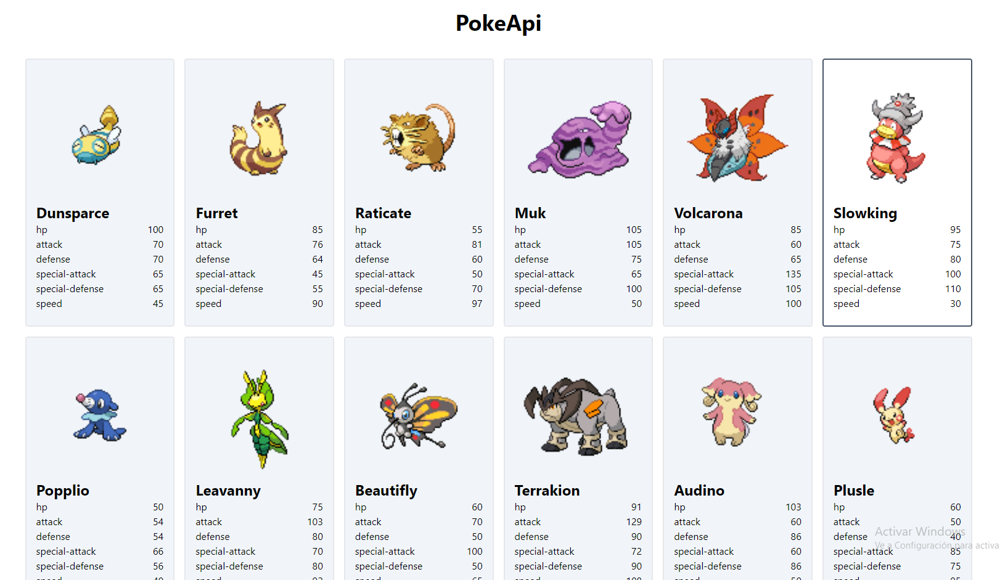

# Pokemon API

***

aplicacion creada con javascript sin librerias o frameworks, para los estilos uso talwindcss con cdn.

para ejecutar esta aplicacion puedes usar live server y ejecutar en tu terminal

## `live-server ./`
